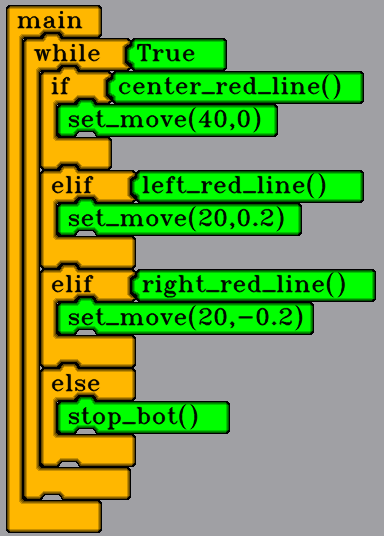
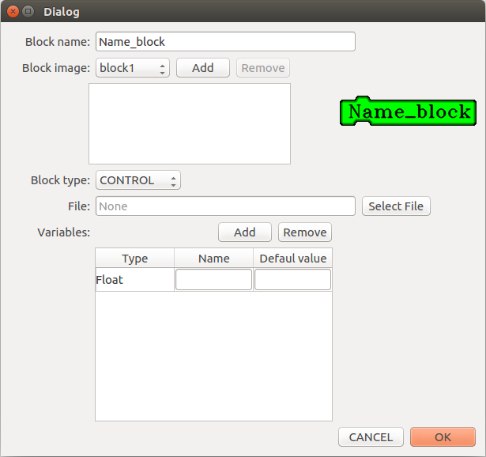
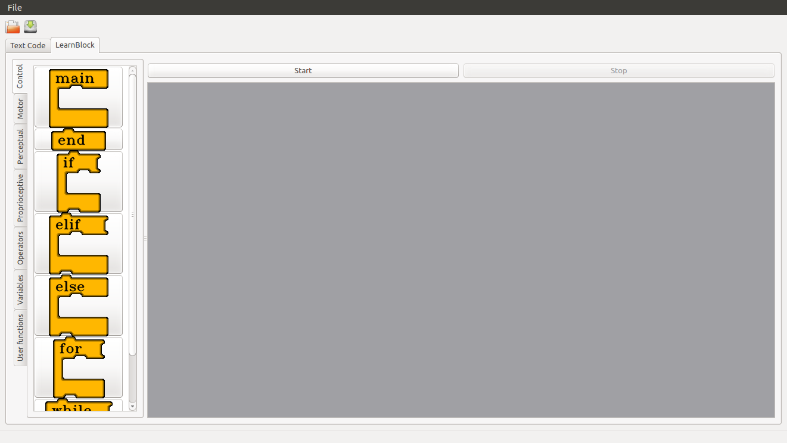

# About Learnblock.

Learnblock is a project to teach children how to program a robot.

This project have a similar IDE to Scratch.The program, that is created by children, is composed of a set of blocks, in a certain order. These blocks represent functions, conditions, variables and operatros. Also, the user can add new funtions and created new variables and new funtions.

Below explained the steps to follow to program the Learnbot with tis IDE:

## Simple program

With this code the LearnBot follow the red lines.

## Use of variables

For use a variable in the program, the user should declare a variable. These variables can use as params of a block. Also, the user can delete a variable of his code.

In the next video show a example for use a variable in the code.

## Add functions to IDE

For add a new functions to IDE, the user should complete the next form.

The user can selected diferents blocks and add difrents variables.

## Create and used a new functions

Create a functions is similar to create a variable,The first step is declare the function, after, complete the function and finaly, use the function.

## Save and Open a project

The user can save and open project, for this the user should click in the next buttons.

